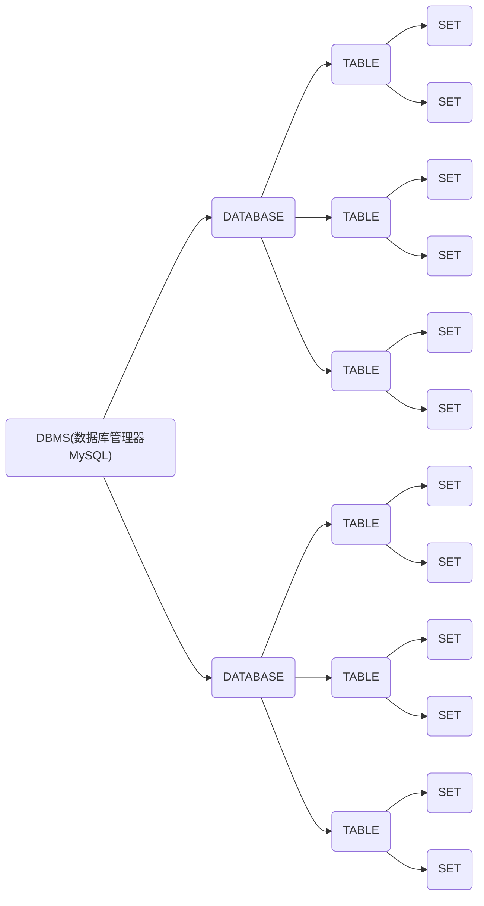

#                                                                                                                                       MySQL基础总览

# MySQL简介

## 1.启动Mysql

通过net服务启动

```shell
net start mysql80
```

关闭

```shell
net stop mysql80
```

## 2.进入并连接Mysql

> 通过MysqlShell

> 通过命令行进入

命令如下：

```shell
mysql [-h ip地址] [-p 端口号] [-u 登录名] -p
```

如果启动本地mysql，-h和-p可以省略

```shell
mysql -u root -p
```

## 3.数据模型 

### 1.关系型数据库 RDBMS

概念：建立再关系模型基础上，由多张相互连接的**二维表**组成的数据库

特点：

**使用表存储数据，格式统一，便于维护**

**使用SQL语言操作，标准统一，使用方便**


> 个人觉得就是由链表写的，有点链式前向星的感觉

#### 2.数据模型


DBMS 数据库管理系统

# SQL语法

## 	SQL通用语法

### 	SQL分类

#### 	DDL - 数据库定义语言

数据定义语言 -- 操作数据库 数据库表 数据库字段的定义

##### 		1.DDL-数据库操作

###### 1.查询

​				查询所有数据库

```sql
SHOW DATABASES
```

​				查询当前数据库

```sql
SELECT DATABESE();
```

###### 				2.创建

​				如果不存在 则创建

```sql
CREATE DATEBASE [IF NOT EXISTS] 数据库名 [DEFAULT CHARSET 字符集] [COLLATE 排序规则];
```

###### 				3.删除 

```sql
DROP DATABASE [IF EXISTS] 数据库名
```

###### 				4.使用

```sql
USE 数据库名
```

##### 2.DDL-表操作-查询

###### 1.查询当前数据库所有表

```sql
SHOW TABLES;
```

​				使用前得适合用use指令进入当前数据库

###### 2.查询表结构

```sql
DESC 表名;
```

###### 				3.查询指定表的建表语句

```sql
SHOW CREATE TABLE 表名;
```

##### 3.DDL-表操作-创建

```sql
CREATE TABLE 表名(
	字段 字段类型 [COMMENT 字段注释],
	字段 字段类型 [COMMENT 字段注释],
	字段 字段类型 [COMMENT 字段注释],
	字段 字段类型 [COMMENT 字段注释],
	字段 字段类型 [COMMENT 字段注释],
	字段 字段类型 [COMMENT 字段注释]
)[COMMENT 表注释];
```

**[...]为可选参数，最后一个字段后面没有逗号**

> 表操作创建练习


```sql
create table user_message(
	id int comment "序号",
	name varchar(50) comment "姓名",
	age int comment "年龄",
	gender varchar(50) comment "性别"
)
```

> 在SQL语句中 varchar用于可变长度字符串，char用于不可变长度字符串
>
> 下面是个人在经验中对可变与不可变字符串的使用总结：
>
> char 常用于一些属性的统计，比如姓名、性别、电话号码、账号、密码等
>
> 而varchar 往往是用来存储文章、代码、以及评论等等
>
> char的性能往往比varchar的性能更好

##### 			4.DDL-表操作-数据类型

​				数据类型较多，主要分为三类：数值类型 字符串类型 日期时间类型	

**DECIMAL (精度：长度 ，标度：小数位数)**

**double(M,D)**


> BLOB 二进制数据T
>
> EXT 文本数据


> 小案例


```sql
create table user_msg(
	id int comment "编号",
    user_id varchar(10) comment "员工工号",
    user_name varchar(10) comment "员工姓名",
    user_sex char(1) comment "员工性别",
    user_age tinyint comment "员工年龄",
    user_idcard char(18) comment "员工身份证号",
    user_joinDate DATE comment "员工生日"
)comment "该表存储员工的个人信息";
```

##### 			5.DDL-表操作-修改&删除

###### 						添加字段

```sql
ALTER TABLE 表名 ADD 字段名 类型(长度) [comment 注释] [约束];
```

> 例子:
>
> 在上面的案例中添加一个字段 昵称
>
> alter table user_msg add user_nickname varchar(10) comment "用户昵称";

###### 修改字段名和字段类型

```sql
ALTER TABLE 表名 CHANGE 旧字段名 新字段名 类型(长度) [comment 注释] [约束];
ALTER TABLE 表名 MODIFY 字段名 类型(长度) [comment 注释(只修改类型)] [约束];
```

**alter table user_msg change user_nickname user_newname varchar(30) comment "用户昵称";**

###### 						删除字段

```sql
ALTER TABLE 表名 DROP 字段名;
```

**alter table user_msg drop user_newname;**

> alter 意为改变
>
> 所以可以这样理解：
>
> 改变 表 那个表 操作 操作单元;
>
> 对表的操作 RENAME TO

###### 					删除表

```sql
DROP TABLE [IF EXISTS] 表名 COMMENT "删除指定表";
TRUNCATE TABLE 表名 COMMENT "删除并重新创建当前表 只删除数据";
```

**删除表时，表中的数据也会一并清除**

#### DML - 数据库操作语言

DML （Data Manipulation Language）数据库操作语言。

**添加数据（INSERT）**

**修改数据（UPDATE)**

**删除数据（DELETE）**

##### 		INSERT的用法

> 给指定字段添加数据

```SQL
INSERT INTO 表名 (字段,字段,...) VALUES (值,值,...)
```

> 给全部字段添加数据
>
> 直接省略 字段的选择

```sql
INSERT INTO 表名 VALUES (值，值，...)
```

然后对于values后面的每一对数据，我们可以用逗号分隔开，以此来批量添加数据

> **注意点**
>
> 1.插入时，指定字段顺序必需和值的顺序是一一对应的
>
> 2.字符串和日期型数据应该包含在引号中
>
> 3.插入的数据大小，应该在字段的规定范围内

##### 	UPDATE的用法

update修改数据

```sql
UPDATE 表名 SET 字段名=值,字段名=值,...[WHERE 条件]
```

比如，我们要修改user表中id=1的字段的name数据，可以这样写

**update user set name="BOB" where id=1**

没有条件默认全部修改

> 在这里说一下set
>
> 
>
> 像一个表，也可以说是一个set

这里可以明显的看出一个关系图




##### DELETE的用法

DLELETE 删除数据

```sql
DELETE FROM 表名 [WHERE 条件]
```

按照上面的想法，那不写where就是删除全部数据，写了where就删除某一条数据

> **delete语句不能够删除某一个字段的值，如果需要，请使用 update 表名 set 字段名 = null where id=1**

#### DQL - 数据查询语言

Data Query Language数据查询语言

语法

> SELECT 字段列表
>
> FROM 表名列表
>
> GROUP BY 分组字段列表
>
> HAVING 分组后条件列表
>
> ORDER BY 排序字段列表
>
> LIMIT 分页参数

##### 基本查询

###### 1.查询多个字段

```sql
SELECT 字段1,字段2,字段3... FROM 表名;
```

```sql
SELECT * FROM 表名;# *号为通配符
```

###### 2.设置别名

```sql
SELECT 字段1 [AS 别名1]...FROM 表名;
```

###### 3.去除重复记录

```sql
SELECT DISTINCT 字段列表 FROM 别名
```

> 注意点，distinct是对你所查询的字段组成的set去重，而不是对某一字段去重

##### 条件查询 WHERE

###### 1.语法

```sql
SELECT 字段列表 FROM 表名 WHERE 条件列表
```

###### 2.条件


##### 聚合函数 count max min

###### 1.介绍

将一列数据作为一个整体，进行纵向的计算

###### 2.常见的聚合函数

count、max、min、avg、sun

> 顾名思义就不写意义了

###### 3.语法

```sql
SELECT 聚合函数(字段列表) FROM 表明;
```

> 注意：所有的null值不参与聚合函数的运算
>
> ***count***包含值为null的行数
>
> 但如果是常量，那就不包含
>
> count *和1包含null
>
> count 字段不包含

##### 分组查询 GROUP BY

按照一个或多个字段来查询

###### 1.语法

```sql
SELECT 字段列表 FROM 表名 [WHERE 条件] GROUP BY 分组字段名 [HAVING 分组后过滤条件]
```

###### 2.where与having区别

**1.执行时机不同**

​	where是分组之前进行过滤，不满足where条件不参与分组；

​	having是在分组后进行过滤

**2.判断条件不同**

​	where不能对聚合函数进行判断，而having可以

> 注意：
>
> 执行顺序：where>聚合函数>having
>
> 分组之后，查询的字段一般为聚合函数和分组字段，查询其他字段无任何意义，会返回第一个出现的

##### 排序查询 ORDER BY

###### 1.语法

```sql
SELECT 字段列表 FORM ORDER BY 字段1 排序方式 ,字段2 排序方式;
```

###### 2.排序方式

**ASC：升序（default）**

**DESC：降序**

##### 分页查询 LIMIT

###### 1.语法

```sql
SELECT 字段列表 FROM 表明 LIMIT 起始索引,查询记录数;
```

> **注意：**
>
> **起始索引从0开始，寝室索引=(查询页码-1)\*每页查询记录数**
>
> **分页查询是数据库的方言，不同的数据库有不同的实现，MySQL是LIMIT**
>
> **如果查询的是第一页数据，起始索引可以省略，直接简写成LIMIT 10**

###### DPL执行顺序


#### DCL - 数据控制语言

Data Control Language 数据控制语言 用于管理数据库 用户 控制数据库的访问权限

##### 管理用户

###### 1.查询用户

```sql
USE mysql;
SELECT * FROM user;
```

> 用户信息存储在mysql数据库的user表中

###### 2.创建用户

```sql
CREATE USER '用户名'@'主机名' IDENTIFIED BY '密码';
```

> 创建用户 itcast，只能够在当前主机localhost访问
>
> create user 'itcast'@'localhost' identified by '123456'

> 创建用户heima，可以在任意主机访问该数据库，密码123456
>
> create user 'heima' @ '%' identified by '123456'

###### 3. 修改用户密码

```sql
ALTER USER '用户名'@'主机名' IDENTIFiED WITH mysql_native_password BY '新密码';
```

###### 4. 删除用户

```sql
DROP USER '用户名'@'主机名';
```

# MySQL 多表查询

## 多表关系

## 多表查询概述

项目开发中，在继续宁数据库表结构设计师，会更军需求及也会之间的关系，分析并设计比表结构，由于业务之间相互关联，所以哥哥表结构之间也村踩着各种联系，基本上分为三种：

- #### 一对多（多对一）

  案例：部门与员工的关系

  关系：一个部门对应多个员工，一个员工对应一个部门
  实现：在多的一方建立外键，指向一的一方

  

- #### 多对多

  案例：学生与课程的关系

  关系：一个学生可以选秀多门课程，一门课程也可以共多个学生选择

  实现：建立第三张中间表，中间至少包含两个外键，分别管理额两方主键

  

- #### 一对一

  案例：用户与用户详情的关系

  关系：一对一关系，多用于单表拆分，将一张表的基础字段放在一张表总，其他详情字段放在另一张表中

  实现：在任意一方加入外键，关联另外一方的主题，并且设置外键为**唯一**的（UNIQUE）

## 内连接

查询两张表交集的部分（准确来说，是有交集的数据）

#### 		隐式内连接

```sql
select 字段列表 from 表1,表2 where 条件 ...;
```

#### 		显式内连接

```sql
select 字段列表 from 表1 [inner] join 表2 on 连接条件 ...;
```

> 如果为表取别名，则不能用原名访问
>
> 当使用selcet同时对两个表进行查询时，查询结果按照自由排列组合

## 外连接

#### 左外连接

```sql
select 字段列表 from 表1 left outer join 表2 on 条件
```

相当于查询表1[左表]的所有数据 包含表1和表2交集部分的数据

#### 右外连接

```sql
select 字段列表 from 表1 right outer join 表2 on 条件
```

左连接：右表循环遍历左表

右连接：左表循环遍历右表

循环匹配，但是主表一定在

## 自链接

```sql
select 字段列表 from 表a 别名a join 表a 别b on 条件
```

### 联合查询

对于Union查询，就是把多次查询的结果合并起来，形成一个新的查询结构集。

```sql
select 字段列表 from 表A ...
UNION[ALL]
select 字段列表 from 表B ...
```

> 有ALL的话不会去重，就是将两次查询的结果合并起来
>
> 去掉ALL，会有去重效果
>
> 合并的查询结果必须保持相同字段，即字段数量、类型一致

## 子查询

概念：SQL语句中嵌套SELECT语句，称为嵌套查询，又称子查询。

```sql
select * from t1 where column1 = (select column1 from t2)
```

子查询外界的语句可以是insert /update/delete/select的任何一个

更具子查询结果不同，分为：

- 标量子查询

  子查询结果为单个值(数字、字符串、日期)，最简单的形式，这种子查询**标量子查询**

  常用操作符： = <> > >= < <=

- 列子查询

  子查询结果为一列

  常用操作符：in、not in、any、some、all

  | 操作符 | 描述                                 |
  | ------ | ------------------------------------ |
  | in     | 在指定的集合范围之内，多选一         |
  | not in | 不在指定的集合范围之内               |
  | any    | 子查询返回列表中，有任意一个满足即可 |
  | some   | 与any等同，使用some的地方可以使用any |
  | all    | 子查询返回列表的所有都必须满足       |

  

- 行子查询

  子查询结果为一行

  常用操作符：=,<>,in,not in

- 表子查询

  子查询结果为多行多列

  常用操作符：in

根据子查询位置，分为：where之后，from之后，select之后

## 多表查询案例

```matlab
clear,close,clc;
syms t;
a=3;
y=a*(1-cos(t));
x=a*(t-sin(t));
K=abs(diff(x,t)*diff(y,t,2)-diff(y,t)*diff(x,t,2))/(diff(x,t)^2+diff(y,t)^2)^1.5;
tt=[pi/4,pi/2,pi];
subs(K,t,tt)
```

# MySQL - 函数

## 1.字符串函数

```sql
concat(s1,s2,...,sn)
lower()
upper()
lpad(s1,num,s2)#左填充
rpad()
TRIM()取出头尾空格
```

## 2.数值函数

```sql
ceil
floor
mod
rand
round
```

## 3.日期函数

```da
curdate 返回当前日期 current
curtime
now 当前日期+时间
year(date)
month(date)
day(date)
date_add(date,interval expr type) 返回一个日期/时间值加上一个时间间隔expr后的时间值
datediff(date1,date2)相差天数
```

## 4.流程函数 每次返回后都会生成一个新的字段

```sql
if(value,t,r)
IFNULL(value1,value2)
case when(v1) then (r1) else (default) end
case [expr] when [v1] then [res1] ...else [default] end
```

# MySQL - 约束

## 概述

### 1.概念

作用与字段上的规则，用于限制表中的书数据

### 2.目的

博爱获赠数据努库中数据的正确、有效、完整性

### 3.分类

| 约束     | 描述                                                     | 关键字      |
| -------- | -------------------------------------------------------- | ----------- |
| 非空约束 | 限制该字段数据不能为null                                 | not null    |
| 唯一约束 | 保证该字段的所有数据都是唯一的、不重复的                 | unique      |
| 主键约束 | 主键是一行数据的唯一标识，要求非空且唯一                 | primary key |
| 默认约束 | 保存数据时，如果为指定该字段的值，则采用默认值           | default     |
| 检查约束 | 保存字段值满足某一个条件                                 | check       |
| 外键约束 | 用来让两张表的数据之间建立连接，保证数据的一致性和完整性 | foreign key |

自动增值关键字：auto_increment

## 外键约束

### 概念

外键用来然两张表的数据之间建立连接，从而保证数据的一致性和完整性

**注意：上述两张表，尽在逻辑层面有关系，但在数据库层面，并未建立外键关联，所以无法保证数据的一致性和完整性**

### 语法

#### 创建表的时候添加外键

```sql
create table 表名{
	字段名 数据类型,
	...
	[constraint] [外键名称] foreign key (外键字段名) references 主表(主表列名)
}
```

```sql
alter table 表名 add constraint 外键名称 foreign key (外键字段名) references 主表(主表列名)
```

> **注意**
>
> 外键字段在主表中必须为**主键**，且不能为子表的逐渐  —— 一个表可以有多个外键，但每个外键连接不同的表
>
> 外键字段与主表中对应的键数据类型必须相同
>
> 外键名称可以自定义

删除外界

```	sql
alter table 表名 drop foreign key 外键名
```

#### 删除/更新行为

| 行为        | 说明                                                         |
| ----------- | ------------------------------------------------------------ |
| no action   | 当在父表中删除/更新对应记录时，首先检查该记录是哦福有对应外键，如果有，则不允许删除/更新（与restrict一致） |
| restrict    | 当在父表中删除/更新对应记录时，首先检查该记录是哦福有对应外键，如果有，则不允许删除/更新（与no action一致） |
| cascade     | 当父表中删除/更新对应记录时，首先检查该记录是否有对应外键，如果有，则也删除/更新外键在子表中的记录 |
| set null    | 当父表中删除对应记录时，首先检查记录是否有对应外键，如果有，则也设置子表中外键值为null(要求该外键允许取null) |
| set default | 父表有变更时，子表将外键列设置成一个默认的值（Innodb不支持） |

```sql
alter table 表明 add constraint 外键名称 foreign key (外键字段) references 主表名(主表字段名) on update cascade on delete cascade
```

# MySQL - 事务

## 事务简介

**事务**是一组操作的集合，它是一个不可分割的工作单位，事务会把所有的操作作为一个整体一起向系统提交或撤销操作请求，即这些操作**要么同时成功，要么同时失败**


默认MySQL的事务时自动提交的，也就是说，当执行一条DML语句，MySQL会立即隐式的提交事务。

## 事务操作

### 通过设置事务提交方式

示例：

1. 查询张三账户余额

   ```sql
   select * from account where name = '张三'
   ```

2. 将张三账户余额 - 1000

   ```sql
   update account set money = money - 1000 where name = '张三'
   ```

   > 程序抛出异常

3. 将李四账户余额 + 1000

   ```sql
   update account set money = money + 1000 where name = '李四'
   ```

- 查看/设置事务提交方式

  ```sql
  select @@autocommit;#查看sql的提交方式
  set @@autocommit=0;#设置为手动提交
  ```

- 提交事务

  ```sql
  commit;
  ```

- 回滚事务

  ```sql
  rollback;
  ```

> 在commit之前任何的修改都是临时的

### 指令

- 开启事务

  ```sql
  start transaction 或 begin;
  ```

- 提交事务

  ```sql
  commit;
  ```

- 回滚事务

  ```sql
  rollback;
  ```

## 事务四大特性ACID

- 原子性（Atiomicity）：

  事务时不可分割的最小操作单元，要么全部成功，要么全部失败。

  

- 一致性（Consistency）：

  事务完成时，必须使所有的数据都保持一致状态

  比如上诉示例中，转账后他们的和是一个恒定的值

- 隔离性（Isolation）:

  数据库系统提供的**隔离机制**，保证事务在不受外部并发操作影响的独立环境下运行。

  

- 持久性（Durability）:

  事务一旦提交或回滚，它对数据库中的数据的改变就是永久的。


> 数据库中的数据是存储到磁盘中的
>
> 

## 并发事务问题

| 问题       | 描述                                                         |
| ---------- | ------------------------------------------------------------ |
| 脏读       | 一个事务读到另外一个事务还没提交的数据。 |
| 不可重复度 | 一个事务先后读取同一条记录，但两次读取的数据不同，称之为不可重复读。 |
| 幻读       | 一个事务按照条件查询数据时，没有对应的数据行，但是在插入数据时，又发现这行数据已经纯在，好像出现了“幻影”。<br />MySQL官方：只要在一个事务中，第二次select多出了row。 |

## 事务隔离界别

| 隔离级别                            | 脏读 | 不可重复读 | 幻读 |
| ----------------------------------- | ---- | ---------- | ---- |
| Read uncommitted（读 未提交）       | √    | √          | √    |
| Read committed（读 已提交）         | ×    | √          | √    |
| Repeatable Read（default 可重复读） | ×    | ×          | √    |
| Serializable （串行化）             | ×    | ×          | ×    |

```sql
#查看事务隔离级别
select @@transaction_isolation;#@@为查看当前系统的变量信息

#设置事务隔离级别
set [session(会话级别)|global] transaction isolation level [read uncommited | ...]
```

### 脏读


### 不可重复读


不可重复读，每次都是从数据库中读，如果时read uncommited则是在最近修改的事务中读

> 脏读和不可重复度的区别：
>
> **脏读**读取到其他表还未提交时的修改，也就是说，当我们设置一个会话窗为read uncommited的时候，我们可以读取到其他会话窗上最新执行指令后的数据（不管是否commit），即**我们在read uncommited下的修改是对当前的备份表进行修改，读取时在其他事务中最新更新的表中进行读取**，也就是读取**别人的备份**
>
> 
>
> **不可重复读**只会读取到它当前事务那时的数据，相当于是所有操作都是对于**私人备份**的。
>
> 
>
>
> **read uncommitted  - 读取未提交的 也就是说包含其他事务**
>
> **read committed - 读取提交的 如果自身备份的表和原表有差别，则重新备份**

**repeat read**


但是这样子会出现**幻读**，也就是说，如果我们在A中执行insert语句，那B中select时，会显示的是备份表，如果在B中insert相同内容时，会提示已存在。

而串行化，就是在进行修改操作的时候加了锁

> 猜想：
>
> 如果有一个指针变量：ptr，存储的是表地址
>
> 假设我们创建了n个事务，主事务A和副事务B,C,D...
>
> ru：
>
> ​		假设主事务所在会话为read uncommitted
>
> ​		当某个副事务中每执行一条指令，ptr的值就会立即更新为当前所操作表的地址
>
> ​		而主事务的select是查询的ptr
>
> rc:
>
> ​		假设主事务所在会话为read committed
>
> ​		当某个副事务中提交后，ptr的值就会立即更新为当前所操作表的地址
>
> ​		而主事务的select查询的是ptr
>
> rr:
>
> ​	 假设主事务所在会话为Repeatable Read
>
> ​	rr的值就是A所备份的表的地址
>
> ​	那么select是查询的rr就是自身的
>
> **对于幻读**
>
> 由于 insert语句首先会判断当前ptr中是否有某个set，如果有，则抛出异常
>
> sb:
>
> ptr和rr的相同
>
> 只不过在整个事务上都加了锁

# 关于本笔记

作者博客：[Karos (www.wzl1.top)](https://www.wzl1.top/)

笔记请配合黑马程序员视频课食用

[黑马程序员 MySQL数据库入门到精通，从mysql安装到mysql高级、mysql优化全囊括_哔哩哔哩_bilibili](https://www.bilibili.com/video/BV1Kr4y1i7ru?p=3&spm_id_from=333.880.my_history.page.click)

用时1周，上面的学完以后可以做基本的数据库的增删改